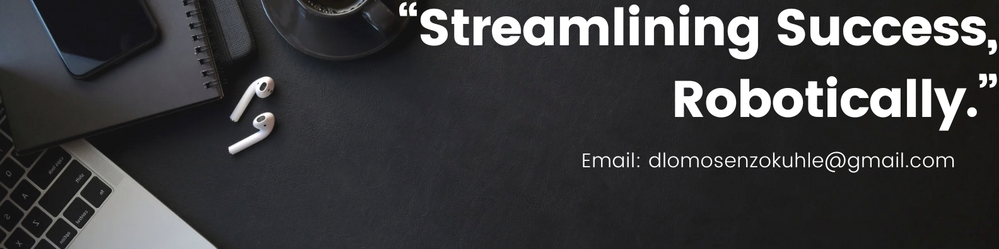

  

<h3>🤝 Let’s Connect!</h3>

  
  
  

<h1 align="center">Hi there, I am Senzo Dlomo 👋</h1>

  <em>Automation Consultant • RPA Developer • Software Engineer</em> 
  <strong>Transforming business processes with code, automation, and intelligent tech.</strong>

<h3>🔧 About Me</h3>

I am a passionate <strong>Software Developer and RPA Consultant</strong> with 6+ years of experience delivering automation, system integration, and digital transformation across industries. I'm particularly fascinated by the potential of AI to enhance automation further and create truly intelligent workflows. I specialise in building <strong>scalable, intelligent solutions</strong> with UiPath and Microsoft technologies, integrating everything from legacy systems to AI-powered services.

<h3>🚀 Tech Stack & Skills</h3>

<h4><strong>Core Expertise</strong></h4>

  
  
  
  
  

<h4><strong>Related Technologies</strong></h4>

  
  
  
  
  
  

<h4><strong>Automation & RPA (Other)</strong></h4>

  

<h4><strong>AI & Intelligent Processing</strong></h4>

  
  

<h4><strong>Databases (Other)</strong></h4>

  
  
  

<h4><strong>DevOps & Tools</strong></h4>

  
  
  
  
  

<h3>🏆 Key Achievements</h3>
<ul>
  <li>✅ Built a <strong>supplier vetting automation</strong> using APIs and OCR to validate and vet suppliers across multiple platforms</li>
  <li>🔐 Developed <strong>secure, reusable RPA libraries</strong>, reducing development time by 40% and removing the need for direct credential handling</li>
  <li>🧠 Created <strong>insightful dashboards</strong> (Power BI, Tableau, Insights) to track ROI and process health</li>
  <li>🌍 Collaborated with <strong>EMEA stakeholders</strong> on high-impact digital transformation initiatives</li>
  <li>⚡ Maintained 99.9% bot uptime with robust production support and proactive monitoring</li>
</ul>

<h3>🎥 RPA Challenge: Solving the Dynamic Form Data Entry</h3>

I recently participated in an exciting <strong>RPA Challenge</strong> from <a href="https://rpachallenge.com/">rpachallenge.com</a>, where the goal was to create an automated workflow capable of inputting data from a spreadsheet into dynamic form fields that change position after every submission. The challenge had the following requirements:

<ul>
  <li><strong>Data Input Automation:</strong> The workflow needed to automatically input data into form fields that change positions after each submission, for a total of <strong>10 rounds</strong>.</li>
  <li><strong>Dynamic Field Recognition:</strong> Since the positions of the fields shift after every submission, the workflow had to <strong>dynamically identify</strong> where each piece of data from the spreadsheet should go, ensuring accuracy on every round.</li>
  <li><strong>Timing Constraints:</strong> The challenge also had a <strong>countdown timer</strong> that started once the "Start" button was clicked, adding pressure to complete the task efficiently.</li>
</ul>

You can watch my full solution in action in this YouTube video, where I walk through the <strong>workflow design</strong> and explain the approach I used to ensure <strong>accuracy, speed, and scalability</strong> across the 10 rounds of changing fields. This showcases my skills in <strong>workflow design, dynamic field handling, problem-solving, and efficient automation development</strong>.

<a href="https://www.youtube.com/watch?v=YOUR_VIDEO_LINK">Watch my RPA Challenge Solution on YouTube</a>

<h3> 🏅 Certifications</h3>
<ul>
  <li>AI Career Essentials - ALX Africa (2024)</li>
  <li>UiPath Certified RPA Associate (UiRPA) - UiPath (2023)</li>
  <li>Power Platform Fundamentals - Microsoft (2020)</li>
  <li>Scrum Fundamentals - SCRUM study (2018)</li>
</ul>

<h3> 🛠️ Currently Working On</h3>
<ul>
  <li>
    <strong>Portfolio Website (NARM Stack):</strong> Developing a portfolio website to showcase my projects, including project descriptions, problem statements, solutions, impact, and tools used.
  </li>
  <li>
    <strong>Public Diary Website (PHP, SQL, HTML):</strong> Building a public diary platform where users can anonymously share their thoughts, receive private messages, and engage in public encouragement (with temporary display of comments).
  </li>
</ul>

<h3> 📄 Download Resume</h3>

  You can download my detailed resume in PDF format: <a href="Resume.pdf">Download Resume</a>

<h3>🌐 Community & Side Projects</h3>
<ul>
  <li>💬 Contributed <strong>70+ solutions</strong> on <a href="https://forum.uipath.com/u/senzod/summary">UiPath Forum</a>, primarily focused on UI Automation and data extraction.</li>
  <li>🏅 Winner of <strong>UiPath Monthly Contributor Reward</strong></li>
  <li>🌐 Built and deployed a live site for a Johannesburg-based investment firm: <a href="https://kopanyoinvest.co.za">kopanyoinvest.co.za</a></li>
</ul>

<em>“Automation is not just a tool — it’s a mindset shift that unlocks innovation, efficiency, and value.”</em>

